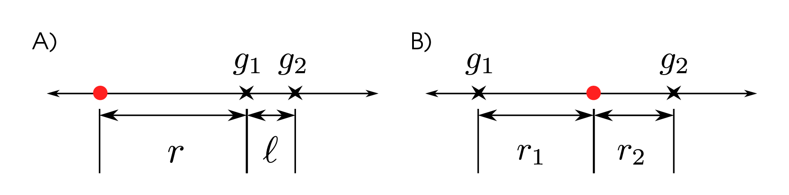

$$
\newcommand{\E}{\mathbb{E}}
\renewcommand{\P}{\mathbb{P}}
\newcommand{\bone}{\mathbf{1}}
\newcommand{\given}{\mid}
\DeclareMathOperator{\sgn}{sgn}
\DeclareMathOperator{\cov}{cov}
$$

```{r doc_setup, include=FALSE}
fig.dim <- 5
knitr::opts_chunk$set(fig.width=2*fig.dim,fig.align='center')
```

**In this document take $\sigma=1$.**

A narrow hybrid zone
--------------------

Suppose that heterozygotes have fitness $(1-s)$;
we know that allele frequencies around a hybrid zone behave as
$$
\begin{aligned}
    \partial_t p(t,x) &= \frac{1}{2} \partial_x^2 p(t,x) - s p(t,x) (1-p(t,x)) (1-2p(t,x)) ,
\end{aligned}
$$
and from `lineage-movement.tex`,
if $A$ is the allele whose frequency is $p$,
an $A$-lineage follows a diffusion with generator 
$$
\begin{aligned}
    G_A f(x)
    &= 
    \frac{1}{2} (1-s(1-p(x))) \partial_x^2 f(x)
    + (2sp(x) + (1-s)) ( \partial_x \log p(x) ) \partial_x f(x) ,
\end{aligned}
$$
i.e., with diffusion speed $(1-s(1-p))$
and drift $(2sp(x) + (1-s)) ( \partial_x \log p(x) )$.

If we move a large distance in the direction where the $A$ allele is disadvantageous,
then $p \to 0$,
and the equation for $p$ becomes 
$$
\begin{aligned}
    \partial_t p(t,x) &= \frac{1}{2} \partial_x^2 p(t,x) - s p(t,x) .
\end{aligned}
$$
At stationarity, so the left side is zero,
along with the boundary condition $\lim_{x \to \infty} p(x) = 0$,
this is solved by
$$
\begin{aligned}
    p(x) \simeq C \exp\left( - x \sqrt{2s} \right) ,
\end{aligned}
$$
and so for $x$ where $p$ is small,
$$
\begin{aligned}
    \partial_x \log p(x) = - \sqrt{2s}
\end{aligned}
$$
and so the diffusion has generator
$$
\begin{aligned}
    \tilde G_A f(x)
    &= 
    \frac{1}{2} (1-s) \partial_x^2 f(x)
    - (1-s) \sqrt{2s} \partial_x f(x) .
\end{aligned}
$$

Let $B_t$ be a standard Brownian motion
and let
$$
\begin{aligned}
X_t = x + B_{(1-s)t} - (1-s) \sqrt{2s} t
\end{aligned}
$$
be the diffusion whose generator is $\tilde G_A$.
We'd like to know the length of the haplotype carried with the lineage,
i.e., if recombination occurs at rate $r$,
whether $X$ hits 0 before an independent Exponential($r$) time.
Applying Brownian scaling, 
rescaling time by $(1-s)$ and space by $\sqrt{1-s}$,
this is the same thing as asking
whether a Brownian motion begun at 0 with drift $c$
and killed at rate $\lambda$
ever hits $x/(\sqrt{1-s})$,
where
$$
\begin{aligned}
    c 
    &=
    (1-s) \sqrt{2s} \times \frac{1}{ \sqrt{(1-s)} } \\
    &=
    \sqrt{2s(1-s)} .
\end{aligned}
$$
and
$$
\begin{aligned}
    \lambda
    &=
    \frac{ r }{ (1-s) } .
\end{aligned}
$$
By Borodin \& Salminen 2.1.1.2,
for a Brownian motion $W^{(c)}$ with drift $c$ and independent Exponential($\lambda$) time $\tau$,
$$
\begin{aligned}
    \P\{ \sup_{0\le t\le \tau} W^{(c)}_t \ge x \}
    &=
    \exp\left( - x \left( \sqrt{2\lambda+c^2} - c \right) \right) .
\end{aligned}
$$

Haplotype length around a rare migrant selected allele
------------------------------------------------------

Let $L$ be the **length of the haplotype** carried by the migrant lineage.
The above tells us that
$$
\begin{aligned}
    \P^x\{ L > r \}
    &= 
    \exp\left( - x \left( \sqrt{2r+2s(1-s)} - \sqrt{2s(1-s)} \right) \right) .
\end{aligned}
$$
Rearranging,
$$
\begin{aligned}
    \P^x\{ L > (u/x\sqrt{2}+\sqrt{s(1-s)})^2-s(1-s) \}
    &= 
    \P^x\{ x\sqrt{2}\left(\sqrt{L+s(1-s)}-\sqrt{s(1-s)}\right) > u \} \\
    &= 
    \exp\left( - u \right) .
\end{aligned}
$$
In other words,
if $Y$ is an Exponential with rate $x \sqrt{2}$,
then $L$ and $(Y+\sqrt{s(1-s)})^2-s(1-s)$ have the same distribution.
(This is a shifted Weibull.)
Therefore,
$$
\begin{aligned}
    \E[L] 
    &= 
    \frac{1}{2x} + \frac{\sqrt{2s(1-s)}}{x} 
\end{aligned}
$$
and we can work out the variance also.

Also note that (for drift $c$ to the right) that the furthest to the left
that $W^{(c)}$ *ever* goes is Exponential($c$).
In our case, that means that rare migrants are usually descended from some ancestor
that's an additional $\sqrt{s(1-s)}$ *further* away from where they came from.


Covariance in ancestry
----------------------

Now suppose that we have two loci, $g_1$ and $g_2$, linked to the selected site,
at genetic distances $r$ and $r+\ell$ respectively,
as in *(A)* of the following figure:



Let $I_1$ be the ancestry of a sampled individual at locus $g_1$,
and likewise $I_2$,
i.e., $I_1=B$ if the sampled individual inherited at $g_1$
from an ancestor living to the right of the barrier at time $\tau$ in the past,
and $I_1=A$ otherwise.
Note that
$$
\cov[\bone_B(I_1),\bone_B(I_2)]
=
\P\{ I_1 = B \} \left( \P\{ I_2 = B \given I_1 = B \} - \P\{ I_2 = B \} \right) .
$$
We may want to work with the covariance,
or maybe the difference of the conditional probability itself.

If there has been no recombination between $g_1$ and $g_2$,
then $I_1=I_2$.
If there has been, then we need to condition on where and when it occurred.
Taking from [this document](brownian-local-times.html),
define ($h=1-\zeta$)
$$
\begin{aligned}
    h(x,r,\tau) 
    &:= \P^x\{ I_1 = B \} \\
    &= 2(1-\Phi(|x|/\sqrt{\tau})) - 2 e^{r\tau|x|+r^2\tau^2/2} (1-\Phi(|x|/\sqrt{\tau}+r\tau)) .
\end{aligned}
$$
Then
$$
\begin{aligned}
    \P\{ I_2 = B \given I_1 = B \}
    &=
    e^{-r\tau}
    +
    \E\left[
    \int_0^\tau \ell e^{-\ell t} h(X_t,r+\ell,\tau-t) dt
    \given
    I_1=B
    \right] ,
\end{aligned}
$$
where $X_t$ is the location of the $g_1$-lineage (then conditioned on $I_1=B$).
If we let $q_t(x,y)$ be the probability density of $X$ conditioned on $I_1=B$,
then
$$
\begin{aligned}
    \P\{ I_2 = B \given I_1 = B \}
    &=
    e^{-r\tau}
    +
    \int_0^\tau 
    \int_{-\infty}^\infty
    q_t(x,y)
    \ell e^{-\ell t} h(y,r+\ell,\tau-t) 
    dy
    dt .
\end{aligned}
$$
What is the motion of $X$ given $I_1=B$?
$X$ moves as a Brownian motion that is sometimes reflected at zero.
